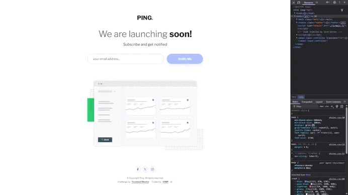

# Frontend Mentor - Ping coming soon page solution

This is a solution to the [Ping coming soon page challenge on Frontend Mentor](https://www.frontendmentor.io/challenges/ping-single-column-coming-soon-page-5cadd051fec04111f7b848da).

Frontend Mentor challenges help you improve your coding skills by building realistic projects.




## Table of contents

[🎯 The challenge](#-the-challenge)

[📸 Screenshots](#-screenshots)

[🔗 Links](#-links)

[⚒️ Built with](#️-built-with)

[🤓 What I learned](#-what-i-learned)

[✨ Author](#-author)

---

## 🎯 The challenge

Users should be able to:

✅ View the optimal layout for the site depending on their device's screen size

✅ See hover states for all interactive elements on the page

✅ Submit their email address using an `input` field

✅ Receive an error message when the `form` is submitted if:
- The `input` field is empty. The message for this error should say *"Whoops! It looks like you forgot to add your email"*
- The email address is not formatted correctly (i.e. a correct email address should have this structure: `name@host.tld`). The message for this error should say *"Please provide a valid email address"*

---

## 📸 Screenshots


---

## 🔗 Links

🚀 [Live Demo ➔](https://vimpdev.github.io/fem-ping-coming-soon-page/)

🌐 [Solution on Frontend Mentor ➔](https://www.frontendmentor.io/solutions/ping-single-column-coming-soon-page-1vnUy9ALdj)

---

## ⚒️ Built with

🔳 Semantic **HTML5** markup

🔳 **Mobile-first** workflow

🔳 **CSS custom properties**

🔳 **CSS Grid** and **Flexbox**

🔳 **JavaScript DOM** manipulation

🔳 **Accessibility** techniques (ARIA, keyboard focus, NVDA tested)

---

## 🤓 What I learned

### 🔍 Regex Email Validation
I used the following regular expression to validate the email format:

```js
/^[\w.-]+@[\w.-]+(\.\w{2,})+$/
```

| Part | Explanation |
| --- | --- |
| `^` | Anchors the match to the start of the string. |
| `[\w.-]+` | Matches one or more characters that are letters, digits, underscores (`_`), dots (`.`), or hyphens (`-`). This represents the **local part** of the email (before the `@`). |
| `@` | Matches the `@` symbol literally. |
| `[\w.-]+` | Matches the **domain name**, which can also include dots and hyphens. |
| `(\.\w{2,})+` | Ensures there is at least one **top-level domain (TLD)** (like `.com`, `.org`, `.co.uk`, etc.). It matches a literal dot followed by **2 or more alphanumeric characters**, and allows for domains with multiple parts. |
| `$` | Anchors the match to the end of the string. |

#### ✅ Valid examples:

* `user@example.com`
* `john.doe@mail.co.uk`
* `my-email@sub.domain.org`

#### ❌ Invalid examples:

* `user@domain` → missing TLD
* `@domain.com` → missing local part
* `user@.com` → invalid domain


### 🧩 ARIA Attributes I Used

| Attribute | Purpose |
| --- | --- |
| `aria-disabled` | Indicates that the element is *visually and functionally disabled*. Unlike `disabled`, it does not prevent focus or submission by default. Useful for custom buttons. |
| `aria-describedby` | Links the element to another element that **describes it** (e.g. error messages, hints). Screen readers will announce the description. |
| `aria-label` | Provides an **invisible label** for screen readers when there is no visible text. Useful for icons or custom controls. |
| `aria-labelledby` | Refers to another element whose content will be used as the **label**. It’s like `aria-label` but references an existing element’s text. |
| `role` | Defines the **semantic role** of an element (e.g., `dialog`, `button`, `alert`). Helps screen readers understand the purpose of non-semantic HTML. |

---

## ✨ Author

🔰 Frontend Mentor - [@vimpdev](https://www.frontendmentor.io/profile/vimpdev)
